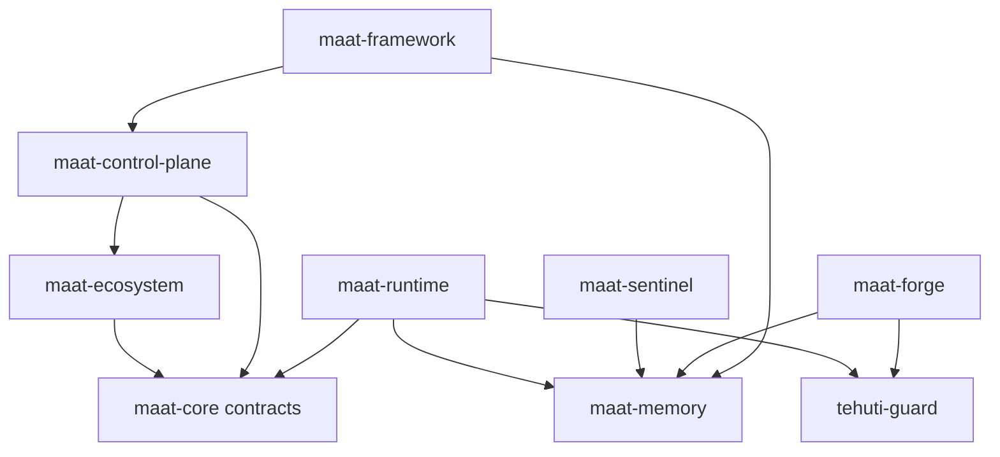

# GitHub repo map (MAAT federation)

This lab is **not** one big monorepo product. It is a **MAAT repo federation**: one umbrella for doctrine and architecture, one interactive runtime body, and separate repos for the control plane, durable memory, enforcement, live awareness, autonomous work, and optional personal packaging.

Use this document when **splitting, naming, or publishing** on GitHub so boundaries stay clear before history and issues get messy.

**Related:** In-tree paths and naming pitfalls → [`MAAT-PRODUCT-MAP.md`](MAAT-PRODUCT-MAP.md). Control plane CLI → [`MAAT-LAB-CONTROL-PLANE.md`](MAAT-LAB-CONTROL-PLANE.md).

**Default ports (identity map):** Sentinel **4242**, Tehuti Guard v1 **8013**, Tehuti Core **8014**, Maat Memory MCP **8022** — canonical table in [`MAAT-PRODUCT-MAP.md`](MAAT-PRODUCT-MAP.md#default-ports-lab-network-identity).

---

## One-sentence model

**We are not building one monolith; we are building a MAAT repo federation with one umbrella architecture repo, one runtime repo, and separate service/product repos for control plane, memory, Guard, Sentinel, and Forge.**

### Lab workspace vs GitHub (missing clarity, stated once)

**The workspace is a lab monorepo that hosts the products as folders until you split or mirror them to GitHub.** That is the working tree for design, test, cross-link, and fast iteration; it is **not** the same thing as the eventual public repo layout.

---

## Three layers

1. **Lab workspace** — One tree: products side by side, shared scripts, docs cross-links, no forced repo surgery while boundaries settle.
2. **Repo federation** — The eventual GitHub shape: umbrella, runtime, control plane, memory, guard, sentinel, forge, optional framework (see table below).
3. **Contract / doctrine layer** — What stays stable across repos: MAAT-Core contracts, immune doctrine, control plane doctrine, product map, repo map. Umbrella + docs carry this until `maat-core` splits on purpose.

Together, these layers stop **maat-ecosystem** from being mistaken for “where every executable must live,” keep **maat-runtime** as the interactive body, and let **maat-memory**, **tehuti-guard**, **maat-sentinel**, and **maat-forge** mature privately before standalone repos.

---

## Canon documents (naming + boundaries)

Use this set to prevent naming drift and repo-boundary confusion:

| Document | Role |
|----------|------|
| [`MAAT-PRODUCT-MAP.md`](MAAT-PRODUCT-MAP.md) | Which product is which path; naming pitfalls |
| [`GITHUB-REPO-MAP.md`](GITHUB-REPO-MAP.md) | This file: federation, public/private, prep |
| [`MAAT-IMMUNE-SYSTEM.md`](MAAT-IMMUNE-SYSTEM.md) | Immune organs and evolution boundaries |
| [`MAAT-LAB-CONTROL-PLANE.md`](MAAT-LAB-CONTROL-PLANE.md) | Operator CLI and control-plane doctrine |
| [`MAAT-LIGHTWEIGHT-INTELLIGENCE.md`](MAAT-LIGHTWEIGHT-INTELLIGENCE.md) | Token-efficient MAAT middleware doctrine |
| [`LAB-CANONICAL-TREE-AND-STACK.md`](LAB-CANONICAL-TREE-AND-STACK.md) | **On-disk tree**, symlinks, runtime stack, `maat-apps` vs `hands/apps` — keep in sync before GitHub README changes |

---

## Canonical GitHub-ready repo list

| Repo | Role | Typical contents | Today (this workspace) |
|------|------|------------------|-------------------------|
| **maat-ecosystem** | Umbrella: constitutional docs, product map, immune docs, control-plane *documentation*, shared schemas *if* this stays the canonical schema home | `MANIFEST.ka`, `skeleton/`, `soul/`, architecture + doctrine MD | `maat-ecosystem/` |
| **maat-core** *(contracts)* | **Law package:** schemas, identity/event/memory/policy contracts, promotion states, validators, shared constants — *not* the TypeScript runtime folder name | Versioned contracts; optional small validation libs | Often `maat-ecosystem/skeleton/` (+ related); **not** the same as `maat-runtime` |
| **maat-runtime** | Interactive **execution body**: coding agent, toolkit runner, CLI/TUI/web execution, MCP **client** behavior, runtime immune hooks | Fork of pi-mono / OpenClaw-derived stack | `maat-runtime/` |
| **maat-control-plane** | **Operator surface**: `maat setup` / `doctor` / `repair` / `enroll`, profiles, manifest validation, machine audits | Python package, `maat` CLI | `maat-control-plane/` |
| **maat-memory** | Durable memory: APIs/MCP, append-safe handling, promotion-safe writes, retrieval | Service + client | Today largely `maatlangchain/maat_memory/` until split |
| **tehuti-guard** | **Immune enforcement** — **Guard v1** HTTP `POST /decision` (Python **`tehuti-guard-api`** in `tehuti-guard/guard/`). **Separate npm product:** [Propershare/tehuti-guard](https://github.com/Propershare/tehuti-guard) MCP proxy — not the same codebase. | Python API + private TS helpers in monorepo | `tehuti-guard/` — see [`TEHUTI-GUARD-PRODUCTS.md`](TEHUTI-GUARD-PRODUCTS.md) |
| **maat-sentinel** | **Live awareness**: sessions/tasks/agents, heartbeats, stale detection, coordination context | Service or library | Often still inside MaatLangChain; long-term its own repo |
| **maat-forge** | **Autonomous workhorse**: schedules, local expert workers, autoresearch, dataset prep, training/eval, MCP-callable bounded jobs | Workers + job definitions | `maat-forge/` (see [`MAAT-FORGE.md`](MAAT-FORGE.md)) |
| **maat-framework** | **Personal product**: single-machine MAAT stack, one CLI, local-first assistant | Python “batteries included” install | `maat-framework/` |

### Optional later

| Repo | Role |
|------|------|
| **maat-studio** | UI / observability (if split from other surfaces) |
| **maat-bench** | Verification suite, cross-repo gates |
| **maat-apps** | App registry / marketplace |

---

## maat-core: where it lives (decision fork)

- **Option A — keep inside maat-ecosystem** until boundaries stabilize: contracts live under the umbrella (e.g. `skeleton/schemas/`, soul) and the umbrella remains the canonical **git** home for schema evolution.
- **Option B — split later** into a dedicated **`maat-core`** (contracts-only) repo once consumers and release cadence are clear.

Do **not** confuse:

- **Constitutional / schema “maat-core”** (contracts) with **`maat-runtime/`** (the TypeScript body). See [`MAAT-PRODUCT-MAP.md`](MAAT-PRODUCT-MAP.md) “Related naming”.

---

## Public vs private (initial recommendation)

| Repo | Suggested visibility | Rationale |
|------|----------------------|-----------|
| **maat-ecosystem** | Public-friendly first | Doctrine and architecture should be legible |
| **maat-runtime** | Public-friendly first | Upstream-aligned runtime; easier collaboration |
| **maat-control-plane** | Public-friendly first | Operator CLI; few secrets by design |
| **maat-memory** | Private longer | Until URLs, retention, and MCP auth stories are hardened |
| **tehuti-guard** | Private longer | Policy surfaces and org rules |
| **maat-sentinel** | Private longer | Coordination and presence semantics |
| **maat-forge** | Private longer | Jobs may touch data paths and local expert configs |
| **maat-framework** | Team choice | Often public if it is a clean “personal stack” demo; scrub paths first |

Adjust per org policy; the point is **do not dump everything public on day one**.

---

## Dependency arrows (logical)

Read **depends on** as “expects APIs, contracts, or operator flow from,” not necessarily a single package import.

- **Umbrella + contracts** sit at the top of the *doctrine* stack.
- **Control plane** reads manifests/profiles and drives setup/doctor/repair/enroll; it does not replace runtime execution.
- **Runtime** consumes contracts and talks to **Guard** and **memory** as configured.
- **Sentinel** and **Forge** coordinate through **memory** (and Guard where policy applies).

---

## What “prepare for GitHub” means

### Now (boundary work)

- Finalize **repo names** (match tables above).
- Write a **minimal README per future repo** (one paragraph + link to maat-ecosystem architecture).
- Define **ownership** (who approves contracts vs runtime vs control plane).
- Decide **public vs private** per repo (use table as default).
- Keep **one architecture map** current: this file + [`MAAT-PRODUCT-MAP.md`](MAAT-PRODUCT-MAP.md).

### Before publishing

- Remove **secrets**, API keys, and machine-specific paths from examples.
- Normalize **docs** and fix broken links.
- Add **LICENSE** where appropriate (consistent across public repos).
- Add **CONTRIBUTING** only where you expect external PRs.
- Issue templates and labels can wait until traffic appears.

---

## Summary table (roles only)

| Repo | One line |
|------|----------|
| maat-ecosystem | Blueprint and doctrine |
| maat-core | Contracts and law (location: umbrella or future split) |
| maat-runtime | Interactive runtime / body |
| maat-control-plane | Setup, audit, repair, enroll |
| maat-memory | Durable memory service |
| tehuti-guard | Enforcement and immunity |
| maat-sentinel | Live awareness |
| maat-forge | Autonomous workhorse |
| maat-framework | Personal installable MAAT stack |
