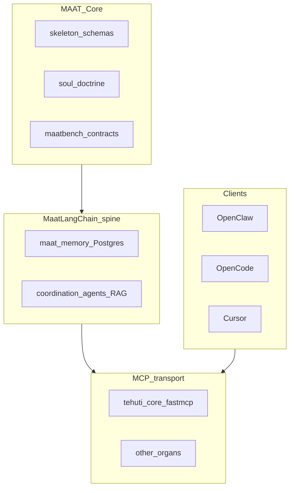

# MAAT framework report — target architecture, as-is state, Tranche 1

**Audience:** Imhotep / Tehuti Lab operators and agents.  
**Tranche 1 (this document + `maat_core/`):** Locator package + documentation only — no new DB tables, no Tehuti Core behavior change.

---

## Executive summary

The lab adopts a **five-layer** mental model so **MCP never becomes the architecture**:

| Layer | Role | One line |
|--------|------|-----------|
| **MAAT Core** | Constitutional truth | Schemas, soul doctrine, bench contracts — **identity outlives runtime** |
| **MaatLangChain spine** | Nervous system | Routing, agents, RAG, **persistent** tasks/memory via Postgres (gitMaat) |
| **MCP layer** | Hands and sockets | **Tool transport** and client/server interoperability — not where governance truth lives |
| **Apps / packs / skills** | Bundled capability | Domain workflows, policy packs, tool packs — **modular**, not kernel spaghetti |
| **Clients / surfaces** | Faces | OpenClaw, OpenCode, Cursor, Tehuti HTTP UIs — **not** system of record |

Supporting lines agreed in-session:

- **MAAT defines truth**
- **MaatLangChain runs continuity**
- **MCP exposes capability**
- **Clients render experience**
- **Fine-tuned models improve worker quality** (multiplier inside the framework, not a replacement for orchestration)
- **MaatBench is the court of truth** — subsystem claims need bench categories, not demos alone

**Key correction:** Avoid **MCP-first** design: if identity, memory semantics, or policy truth drift into “whatever the MCP server implements,” portability and auditability fracture. Contracts stay **central**; transport stays **swappable**.

---

## Target architecture (reference)



Data and control intent:

- **Core** versions schemas and doctrine; **spine** enforces continuity and persistence; **MCP** carries tools across hosts; **clients** initiate requests; **Bench** verifies guarantees.

---

## As-is inventory (ground truth in this repo)

| Layer | Location | Notes |
|--------|-----------|--------|
| **Constitutional schemas** | [`maat-ecosystem/skeleton/schemas/`](../maat-ecosystem/skeleton/schemas/) | Seven JSON Schemas including [`maat_event.schema.json`](../maat-ecosystem/skeleton/schemas/maat_event.schema.json), task, memory, policy, tool, identity, learning |
| **Doctrine (soul)** | [`maat-ecosystem/soul/`](../maat-ecosystem/soul/) — read [`constitution.md`](../maat-ecosystem/soul/constitution.md) first | Sacred layer: memory **classes**, policy **semantics**, **event taxonomy** intent, task **lifecycle** |
| **Spine — memory / tasks** | [`maatlangchain/maat_memory/`](../maatlangchain/maat_memory/) | `MaatMemory`, Postgres backend, gitMaat coordination |
| **Spine — orchestration** | [`maatlangchain/core/agents/`](../maatlangchain/core/agents/), [`maatlangchain/maat_memory/coordination.py`](../maatlangchain/maat_memory/coordination.py) | Agents, RAG chains, task distribution |
| **MCP transport** | [`mcp-servers/`](../mcp-servers/) e.g. [`tehuti_core_server.py`](../mcp-servers/tehuti-core/tehuti_core_server.py) | FastMCP tools; **drift risk:** workspace + `PGVECTOR_DB_URL` bootstrap **in-process** — correct long-term is spine-owned config, MCP as thin adapter (deferred) |
| **Bench** | [`maat-ecosystem/maatbench/`](../maat-ecosystem/maatbench/) | Categories: contract integrity, policy fidelity, memory fidelity, event fidelity, portability, behavior balance, learning safety — see [`README.md`](../maat-ecosystem/maatbench/README.md) |
| **Ka body map** | [`maat-ecosystem/MANIFEST.ka`](../maat-ecosystem/MANIFEST.ka) | Network ports, organs — live discovery `8010/manifest` when running |
| **Prior docs** | [`docs/MAATCODE-FORK-STRATEGY.md`](MAATCODE-FORK-STRATEGY.md), [`docs/LAB-TRAINING-PIPELINE-AND-GEMMA4.md`](LAB-TRAINING-PIPELINE-AND-GEMMA4.md), [`docs/TEHUTI-LAB-TREE.md`](TEHUTI-LAB-TREE.md), [`docs/GITMAAT-CONNECT.md`](GITMAAT-CONNECT.md) | OpenCode overlay, training pipeline, lab tree, agent connect |

**Naming clarity:** The **de facto** constitutional core is **`maat-ecosystem/skeleton` + `maat-ecosystem/soul` + `maatbench/contracts`** — not the same as **`maat-runtime/`**, the **TypeScript** user runtime (Pi fork; GitHub `Propershare/Maat-runtime`). Tranche 1 adds a **Python locator** [`maat_core/`](../maat_core/) (underscore) so code and docs have **one import path** to schema/soul/bench artifacts. See [`docs/MAAT-PRODUCT-MAP.md`](MAAT-PRODUCT-MAP.md).

---

## As-is vs to-be (summary)

| Concern | As-is | To-be (staged) |
|---------|--------|------------------|
| Core packaging | Scattered paths under `maat-ecosystem` | **`maat_core` resolves paths** (Tranche 1); optional later: published package |
| Event fidelity | Schema defined; **not** uniformly emitted on every tool/memory path | Unified emit + audit aligned to `maat_event` (deferred) |
| MCP vs spine | Tehuti loads `.env` / workspace; tools coupled to process | Bootstrap centralized in spine; MCP **adapter-only** surface (deferred) |
| Tool abstraction | Clients know OpenAPI/MCP URLs | Single internal capability contract; MCP vs native behind façade (deferred) |
| Packs | `blood/packs/` concept in MANIFEST | Installable manifests + bench gate (deferred) |
| Proof | MaatBench runs on contracts / partial `maat_core` optional deps | Full ecosystem gates + live organ health in CI where possible (deferred) |

---

## Tranche 1 changelog (completed scope)

1. **This report** — [`docs/MAAT-FRAMEWORK-REPORT.md`](MAAT-FRAMEWORK-REPORT.md) (single canonical map).
2. **`maat_core/`** — Minimal Python package:
   - Resolves workspace root (walk parents for `maat-ecosystem/skeleton/schemas`, or `.cursorrules` + `maat-ecosystem`, fallback `~/.n8n`).
   - Exposes `MAAT_ECOSYSTEM_ROOT`, `SCHEMAS_DIR`, `SOUL_DIR`, `MAATBENCH_CONTRACTS_DIR`, `list_schema_paths()`, `CORE_VERSION`.
   - [`maat_core/README.md`](../maat_core/README.md) and optional [`check_paths.py`](../maat_core/check_paths.py).
3. **README wiring** — [`maat-ecosystem/README.md`](../maat-ecosystem/README.md), [`maatlangchain/README.md`](../maatlangchain/README.md), [`docs/TEHUTI-LAB-TREE.md`](TEHUTI-LAB-TREE.md), optional [`MEMORY.md`](../MEMORY.md) pointer.

**Explicitly not in Tranche 1:** event bus implementation, Tehuti refactor, pack enforcement, new MaatBench runners against live HTTP.

---

## Deferred tranches (recommended order)

**Operational queue + enforcement:** [`docs/MAAT-CHECKPOINT-NEXT-TRANCHE.md`](MAAT-CHECKPOINT-NEXT-TRANCHE.md) (CEO memo, numbered tasks, [`scripts/enforce-maat-contracts.py`](../scripts/enforce-maat-contracts.py)).

1. **Event contract first** — Every significant action produces a canonical event (types per `maat_event.schema.json`); replay and MaatBench **event_fidelity** extended to runtime paths.
2. **Memory classes** — Keep episodic, semantic, constitutional, task, working **separate by contract** (already named in [`constitution.md`](../maat-ecosystem/soul/constitution.md)); enforce in `maat_memory` APIs and schemas.
3. **Tool contract** — One internal façade; MCP and native Python tools implement the same interface; orchestrator stays transport-agnostic.
4. **App / pack manifests** — Move domain logic into installable packs; bench **installability** checks.
5. **Benchmark gating** — Release promotion requires MaatBench tier + evidence (see [`maatbench/README.md`](../maat-ecosystem/maatbench/README.md) MAAT Score tiers).

**Fine-tuning:** Proceed **after** traces and contracts are stable; workers improve format/tool behavior; **MaatLangChain + MAAT Core** still own orchestration and truth.

---

## How to verify Tranche 1

```bash
cd /path/to/.n8n
python3 -c "import maat_core; print(maat_core.SCHEMAS_DIR); print(list(maat_core.list_schema_paths())[:3])"
python3 maat_core/check_paths.py
```

Expect non-empty schema list when `maat-ecosystem/skeleton/schemas` exists.

---

## References

- MaatBench categories: [`maat-ecosystem/maatbench/README.md`](../maat-ecosystem/maatbench/README.md)
- Constitution (sacred layer): [`maat-ecosystem/soul/constitution.md`](../maat-ecosystem/soul/constitution.md)
- Locator package: [`maat_core/README.md`](../maat_core/README.md)

**Document version:** 1.0 (Tranche 1 complete — report + `maat_core` locator + README links).
