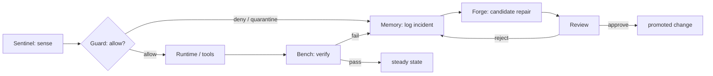
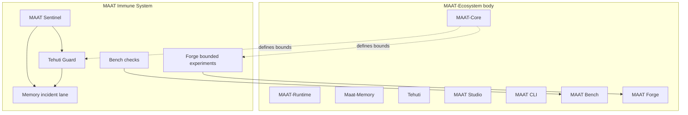

# MAAT Immune System

**Status:** Constitutional blueprint — names a **distributed subsystem** already implied by Tehuti Lab doctrine. It does not replace [`MAAT-PRODUCT-MAP.md`](MAAT-PRODUCT-MAP.md); it describes **how protection, sensing, memory, verification, and bounded adaptation work together**. See [`MAAT-ZERO-TRUST-AUTONOMY.md`](MAAT-ZERO-TRUST-AUTONOMY.md) for **initiation envelopes**, **identity**, and **containment** against hostile or injected actors.

**Rule:** The system may adapt at the edges, but not corrupt its constitution. Self-evolving intelligence operates on **replaceable** layers under promotion rules; **sacred** layers remain stable except through governed change.

---

## 1. The complete body (organs)

The lab is **not** one repo and not one runtime. It is a living body with distinct organs.

| Organ | Role | Notes / path |
|--------|------|----------------|
| **MAAT-Ecosystem** | The whole body — umbrella: constitutional layer, memory, apps, studio, CLI, learning doctrine, replaceable adapters | [`maat-ecosystem/`](../maat-ecosystem/) |
| **MAAT-Core** | Constitutional **kernel** — law, not runtime: schemas, policy semantics, event taxonomy, memory **classes**, learning contract, sacred vs replaceable boundary | [`maat-ecosystem/skeleton/`](../maat-ecosystem/skeleton/), [`soul/`](../maat-ecosystem/soul/) — not the `maat-runtime/` folder |
| **MAAT-Runtime** | Local **execution** body — Pi/OpenClaw lineage: user agents, coding workflows, toolkits, CLI/TUI/web, MCP **client** behavior | [`maat-runtime/`](../maat-runtime/) — obeys Core; does not redefine it |
| **Maat-Memory** | Durable **nervous system** + archive: episodic, semantic, constitutional lanes, tasks, working context | [`maatlangchain/maat_memory/`](../maatlangchain/maat_memory/) (gitMaat) |
| **Tehuti** | **Reasoning / interpretation** organ — not the whole body, not memory, not law | Tehuti Core MCP / brain services per Ka discovery |
| **Tehuti Guard** | **Protective enforcement** — allow, deny, escalate, quarantine, review | [`tehuti-guard/`](../tehuti-guard/) |
| **MAAT Sentinel** | **Live awareness** — who is active, roles, live tasks, health / stall / fail / quarantine (situational awareness, not durable memory) | Agent profile + code: [`maatlangchain/maat_agents.yaml`](../maatlangchain/maat_agents.yaml) (`sentinel`), [`maatlangchain/core/agents/sentinel.py`](../maatlangchain/core/agents/sentinel.py) |
| **MAAT Studio** | **Eyes / dashboard** — observability, replay, governance view, audit inspection | Product surface (TBD / partial); align with ecosystem site + tooling |
| **MAAT CLI** | **Operator hand** — steer, inspect, migrate, manage | Split across `maat-runtime` CLI, ecosystem CLI, framework where applicable |
| **MAAT Bench** | **Proof** organ — verifies the body still obeys the constitution | [`maat-ecosystem/maatbench/`](../maat-ecosystem/maatbench/) |
| **MAAT Forge** | **Metabolic / workhorse** (planned) — scheduled jobs, bounded experiments, train/eval prep, background MCP-callable work | [`MAAT-FORGE.md`](MAAT-FORGE.md) |

```text
MAAT-Ecosystem
│
├── MAAT-Core        = constitution / law
├── MAAT-Runtime     = local execution body
├── Maat-Memory      = durable nervous system / archive
├── Tehuti           = reasoning organ
├── Tehuti Guard     = enforcement / protection organ
├── MAAT Sentinel    = live awareness organ
├── MAAT Studio      = observability / eyes
├── MAAT CLI         = operator hand
├── MAAT Bench       = verification / diagnostic organ
└── MAAT Forge       = adaptive workhorse / experiment engine
```

---

## 2. Why the immune system is distributed

Immunity must **not** live in only one place. If all anomaly detection and adaptive defense lived only in **Tehuti Guard**, Guard would absorb sensing, history, diagnostics, and adaptation — and collapse under mixed concerns.

**Principle:** Guard is a major immune organ, not the entire immune system.

---

## 3. MAAT Immune System (subsystem)

A **named** distributed subsystem:

```text
MAAT Immune System
│
├── Tehuti Guard     = blocks and quarantines (gate)
├── MAAT Sentinel    = detects and watches (sensing)
├── Maat-Memory      = incident / lesson lane (history)
├── MAAT Bench       = tests integrity (diagnostics)
└── MAAT Forge       = proposes and tests bounded repairs (adaptation lab)
```

| Layer | Immune role | Analogy |
|--------|-------------|--------|
| **Tehuti Guard** | Block unsafe action; detect policy bypass; enforce identity and contract compliance; quarantine; stop constitutional corruption; require review for high-risk adaptation | Skin + barrier immunity |
| **MAAT Sentinel** | Abnormal session patterns, repeated failures, unusual concurrency, suspicious role changes, stalled loops, anomalous runtime behavior | Sensory arm of immunity |
| **Maat-Memory** | Repeated anomalies, Guard denials, failure patterns, false positives, successful recoveries, lessons from incidents | Immune memory |
| **MAAT Bench** | Continuous testing: contracts, learning reversibility, policy fidelity, event integrity, portability, memory safety | Lab diagnostics |
| **MAAT Forge** | Bounded self-debugging: safer prompts, scoring/routing experiments, repair candidates, differential tests — **without** direct mutation of sacred Core | Bone marrow / controlled adaptation chamber |

**MAAT-Core** defines **what may and may not change**; it is not listed as an “immune organ” but as the **constitutional frame** inside which immunity operates.

---

## 4. Where self-debugging and self-evolving intelligence live

| Concern | Primary home |
|--------|----------------|
| Block, quarantine, enforce | **Tehuti Guard** |
| Detect and surface anomalies | **MAAT Sentinel** (+ observability into Studio) |
| Remember incidents and lessons | **Maat-Memory** |
| Verify integrity and regressions | **MAAT Bench** |
| Propose and test repairs / improvements | **MAAT Forge** |
| Define sacred vs replaceable | **MAAT-Core** |

**Not only Guard, not only Forge, not only Memory** — the full loop is split as above.

---

## 5. Self-evolution boundaries (hard table)

| May self-evolve at the edges (under promotion rules) | Constitutionally frozen / not freely auto-mutated |
|------------------------------------------------------|---------------------------------------------------|
| Prompts, system prompt templates | Sacred **schemas** (`maat-ecosystem/skeleton/schemas/`) |
| Scoring heuristics, ranking thresholds | **Policy semantics** in soul / constitution |
| Extraction patterns, summarization for UI | **Event taxonomy** meaning (emit rules, required fields) |
| Routing logic, low-risk workflows | **Constitutional memory** promotion semantics |
| Candidate rules **under review** | **Guard hard doctrine** (change only via governed process) |
| Tool routing, adapter behavior (replaceable) | **Audit emission** contract violations |
| | **Identity model** (who is an agent, promotion of identity) |

**MAAT self-evolution rule:** Adaptation is allowed **at replaceable layers**; sacred meaning stays stable while adapters and operators evolve around it.

### 5.2 Constitutional freeze list (never autonomously mutable)

The following are **not** mutable by autonomous agents, schedulers, or silent promotion. Change requires **explicit human-approved amendment** (change control, review, and audit — not model discretion):

| Frozen artifact | Why |
|-----------------|-----|
| **Sacred schemas** | Ground truth for contracts and interchange |
| **Guard hard doctrine** | Baseline allow / deny / quarantine / identity |
| **Constitutional memory** | Durable constitutional facts and their promotion rules |
| **Policy semantics** | Meaning in soul/constitution — not cosmetic rewording |
| **Audit emission rules** | What must be logged, required fields, ordering |
| **Identity model** | What an agent is and how identity is asserted and promoted |
| **Promotion semantics** | How a change graduates from candidate to binding law |

### 5.3 Constitutional violation rule

Any signal or event classified at **constitutional** severity (§7) is a **breach of law**, not a routine failure. The following are **mandatory** — no silent continuation, no autonomous “fix,” no Forge promotion without human gate:

| Step | Owner | Action |
|------|--------|--------|
| 1 | **Tehuti Guard** | **Immediate quarantine** of the affected scope (session, actor, tool chain, or artifact — per Guard policy). |
| 2 | **Maat-Memory** | **Record** the incident in the incident/lesson lane with full provenance. |
| 3 | **MAAT Studio** | **Alert** operators (visible, non-ignorable signal when Studio exists). |
| 4 | **Human** | **Explicit review** before any unblock, resume, or promotion that would affect sacred layers or doctrine. |

**No auto-recovery at this tier:** constitutional severity means **halt first**; recovery paths run only after governed review. This blocks model drift, silent mutation, and “smart but ungoverned” repair at the highest level.

---

## 6. Promotion authority matrix

| Change class | Auto-promote | Human / governance required | Forbidden (autonomous) |
|--------------|----------------|-----------------------------|-------------------------|
| Prompt / template tweak in sandbox | ✓ if scoped + Bench green | If touches production default | N/A |
| Scoring / threshold in experiment branch | ✓ within Forge job output | Merge to prod defaults | — |
| New candidate rule for Guard | — | ✓ review | Auto-apply to production Guard |
| Schema / soul / constitution edit | — | ✓ explicit change control | Any silent mutation |
| gitMaat lesson rows from incidents | ✓ (append-only patterns) | Promotion to “doctrine” if any | Delete audit trail |
| Repair patch touching `skeleton/` or `soul/` | — | ✓ | Autonomous merge |

*(Refine rows as your governance matures; this table is the template.)*

---

## 7. Immune severity levels

Every immune-related signal should carry a **severity** so Sentinel can show urgency, Guard can escalate, Studio can filter, and Forge can prioritize experiments.

| Level | Meaning |
|--------|--------|
| **info** | Routine signal; no immediate action (e.g. lesson recorded, repair closed) |
| **warning** | Anomaly worth attention; surface in Sentinel / Studio; may escalate to high |
| **high** | Quarantine risk, regression, or integrity failure — Guard or Bench must act |
| **critical** | Active policy bypass, imminent harm, or severe integrity break |
| **constitutional** | Threat to sacred layer, doctrine, or audit contract — **halt** and human review — see **§5.3** |

---

## 8. Immune events — taxonomy, default severity, first-response ownership

Emit or log these (aligned with your `maat_event` discipline where applicable) so **Sentinel, Studio, Memory, Guard, and Bench** share one vocabulary. **First-response owner** = who owns the *initial* triage and routing (not exclusive ownership of the full lifecycle).

| Event type | Meaning | Default severity | First-response owner |
|------------|---------|------------------|------------------------|
| `anomaly.detected` | Abnormal pattern surfaced | **warning** (→ **high** if repeated / correlated) | **MAAT Sentinel** |
| `policy.bypass_attempt` | Possible circumvention of policy or contract | **critical** | **Tehuti Guard** |
| `quarantine.applied` | Actor / session / artifact isolated | **high** | **Tehuti Guard** |
| `regression.detected` | Bench or CI caught integrity / contract regression | **high** | **MAAT Bench** |
| `lesson.distilled` | Incident lane recorded distilled lesson | **info** | **Maat-Memory** |
| `repair.candidate_generated` | Candidate fix produced under Forge bounds | **info** | **MAAT Forge** |
| `repair.approved` | Human or governance promoted a repair | **info** | **Human / governance** |
| `repair.rejected` | Candidate discarded with reason | **info** | **MAAT Forge** (close loop; Memory **logs** for audit) |

**Overlap guard:** If two organs could claim an event, **route by type first** (table above), then **escalate severity** through Sentinel → Guard → human as needed.

**Constitutional severity:** Any event **reclassified to** or **emitted at** **constitutional** severity triggers the full **§5.3** response (Guard quarantine → Memory record → Studio alert → human review before continuation). No automatic downgrade.

Extend the list as Studio and event pipelines harden.

---

## 9. Self-debugging loop (conceptual)



---

## 10. Visual architecture — immune layer on the body



---

## 11. Strengths of the current blueprint (audit summary)

1. **Sacred vs replaceable** is explicit — foundation of order.
2. **Memory, policy, runtime, learning, verification** are separate pillars, not one blob.
3. **MaatLangChain** doctrine: adapters must not invent canon; consume and emit through shared contracts.
4. **Centered concerns:** identity, session/task context, traceability, typed content, event compliance, policy integration.
5. **Learning doctrine:** reversible, snapshot-backed, controlled adaptation.

**Tightening delivered by this doc:** Name the **MAAT Immune System** as a subsystem; state **evolution boundaries**, **constitutional freeze**, **constitutional violation response (§5.3)**, **promotion authority**, **immune severity**, and **first-response ownership** in one place; provide **immune event** names for telemetry and gitMaat.

---

## See also

- [`docs/SYSTEM-CONNECTIONS.md`](SYSTEM-CONNECTIONS.md) — **operator map** (components, calls, failures)  
- [`docs/ENDPOINTS-AND-DECISIONS.md`](ENDPOINTS-AND-DECISIONS.md) — **Guard / Sentinel HTTP**, wire vocabulary  
- [`docs/FIRST-RUN.md`](FIRST-RUN.md) — **5‑minute** health + `/decision` sanity path  
- [`docs/MAAT-ZERO-TRUST-AUTONOMY.md`](MAAT-ZERO-TRUST-AUTONOMY.md) — initiation envelopes, identity stack, prompt containment, dual containment
- [`maat-runtime/packages/coding-agent/docs/maat-immune-hooks.md`](../maat-runtime/packages/coding-agent/docs/maat-immune-hooks.md) — **runtime intercept points** (extension, env vars, sacred path block)
- [`maat-forge/README.md`](../maat-forge/README.md) — first Forge job after hooks
- [`docs/MAAT-PRODUCT-MAP.md`](MAAT-PRODUCT-MAP.md) — repo / folder product boundaries
- [`docs/MAAT-FORGE.md`](MAAT-FORGE.md) — forge scope and non-goals
- [`docs/MAAT-FRAMEWORK-REPORT.md`](MAAT-FRAMEWORK-REPORT.md) — layered architecture
- [`docs/WORKSPACE-KA-MAP.md`](WORKSPACE-KA-MAP.md) — Ka organs ↔ folders
- [`tehuti-guard/`](../tehuti-guard/) — enforcement implementation
