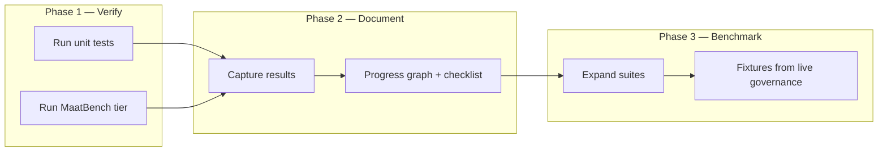
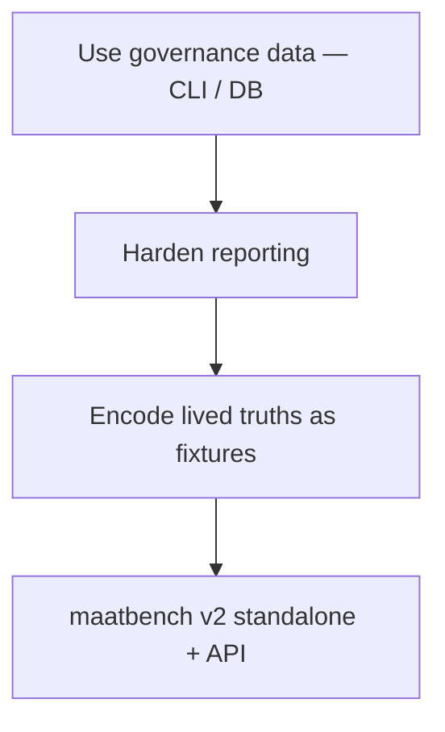

# MAAT verification progress

**Purpose:** Record *test → document → benchmark* sequencing, last-run evidence, and what comes next. Aligns with [`MAATBENCH-v2.md`](./MAATBENCH-v2.md) (governance data first, then fixtures, then standalone `maatbench`).

---

## Progress graph



**Sequencing (from MAATBENCH v2 — non-negotiable):**



---

## Checklist

| Step | Status | Notes |
|------|--------|--------|
| `maat-runtime` coding-agent tests | Done | See last run below |
| MaatBench `contract_integrity` | Done | Run from `maat-ecosystem/` |
| MaatBench full suite (`maat_core`) | Optional / later | Needs Python `maat_core` path |
| Governance events exercised (`maat governance`, DB) | In progress | Per v2, precedes serious benchmark expansion |
| Benchmark fixtures from real failures/successes | Next | After reporting gaps are visible |

---

## Last run log

**Date:** 2026-04-12 (lab host)

### `maat-runtime` — `packages/coding-agent`

```bash
cd maat-runtime/packages/coding-agent && npm test
```

| Metric | Result |
|--------|--------|
| Test files | 86 passed, 7 skipped |
| Tests | 956 passed, 47 skipped |
| `maat-immune.test.ts` | 8 passed |
| Duration | ~4.3s |

### MaatBench — `contract_integrity` only

```bash
cd maat-ecosystem && python3 -m maatbench.run --category contract_integrity --verbose
```

| Metric | Result |
|--------|--------|
| Tests | 11/11 passed |
| MAAT score (category) | 100% |
| Scope | JSON Schema contracts only |

**Important:** Invoke as `python3 -m maatbench.run` from **`maat-ecosystem/`**, not from inside `maatbench/` (the package is `maatbench` on `PYTHONPATH` via the parent directory).

---

## Next: benchmarking

1. **Keep running** `contract_integrity` on every governance/runtime change that touches schemas under `maat-ecosystem/maatbench/contracts/`.
2. **When `maat_core` is available:** run full `python3 -m maatbench.run --verbose` (or per-category) and paste scores into this file or CI artifacts.
3. **Follow v2:** prioritize [`MAATBENCH-v2.md`](./MAATBENCH-v2.md) sequencing — governance reporting hardening before inventing new abstract scenarios.
4. **One-shot lab script:** `bash scripts/run-tehuti-local-tests.sh` (Ollama + Gemma checks + MaatBench contract tier).

---

## Related

- [`MAATBENCH-v2.md`](./MAATBENCH-v2.md) — product boundary, API sketch, suites
- [`maat-ecosystem/maatbench/README.md`](../maat-ecosystem/maatbench/README.md) — categories, MAAT score
- [`docs/MAAT-IMMUNE-SYSTEM.md`](./MAAT-IMMUNE-SYSTEM.md) — immune / bench relationship
