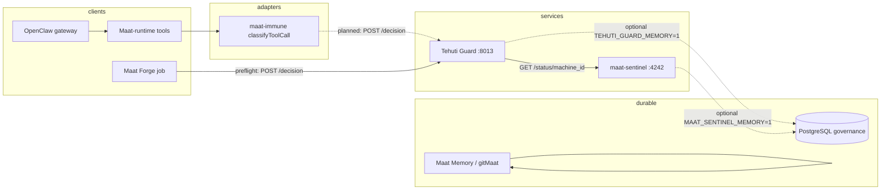

# System connections (operator map)

**Purpose:** One page for **what exists**, **who calls whom**, **what is authoritative**, and **what happens when something is down** — without tribal knowledge.

**See also:** [`ENDPOINTS-AND-DECISIONS.md`](ENDPOINTS-AND-DECISIONS.md) (exact HTTP), [`FIRST-RUN.md`](FIRST-RUN.md) (bootstrap order), [`MAAT-PRODUCT-MAP.md`](MAAT-PRODUCT-MAP.md) (repo names), [`LAB-CANONICAL-TREE-AND-STACK.md`](LAB-CANONICAL-TREE-AND-STACK.md) (folder tree + tech stack).

---

## 1. Components (lab stack)

| Component | Role | Typical path / repo in this workspace |
|-----------|------|--------------------------------------|
| **OpenClaw gateway** | Channels, sessions, tool execution surface for agents | `openclaw/` |
| **Maat-runtime** (coding agent, extensions) | Node-side execution: tools, **maat-immune** local gate | `maat-runtime/` |
| **Hermes-agent** (optional) | Agent experiments / skills — **not** the same as maat-sentinel HTTP | `hermes-agent/` |
| **maat-sentinel** | Live awareness: JSONL + `unified_view` per `machine_id`; HTTP **4242** | `maat-sentinel/` |
| **Tehuti Guard (Python decision API, lab)** | HTTP **8013** — `POST /decision` uses Sentinel view + rules | `tehuti-guard/guard/` |
| **Tehuti Core (brain service)** | MCP/OpenAPI **8014** — coordination + tool gateway (legacy label `maat-core` may appear in older configs) | `maat-ecosystem/mcp-servers/` |
| **Guard adapters** | Local interceptors (e.g. `classifyToolCall` in maat-immune) — **deterministic**; may or may not call Guard HTTP yet | `maat-runtime/.../maat-immune/` |
| **Maat Memory / gitMaat** | Durable coordination + optional governance rows | `maatlangchain/maat_memory/` |
| **PostgreSQL** | When enabled: `maat_governance_events` for Guard/Sentinel logging | env `PGVECTOR_DB_URL` / `.env` |
| **MCP servers / tool providers** | External capabilities (filesystem, memory, ComfyUI, …) | `maat-ecosystem/mcp-servers/` (root `mcp-servers` → symlink), Ka discovery **8010** |
| **Ka discovery** | HTTP manifest of organ endpoints (`GET /manifest`) | port **8010** |

**Authoritative for “final wire decision” on a protected action:** **Tehuti Guard v1** response from `POST /decision` (when integrated). **maat-sentinel** is authoritative for **machine posture** (`unified_view`) and feeds Guard; it is **not** the same as the Guard’s `POST /decision` JSON (Guard **consumes** Sentinel).

---

## 2. Who calls whom (data flow)

**Synchronous vs optional**

| Call | Typical pattern |
|------|-----------------|
| **Guard → Sentinel** | **Synchronous** on each `/decision`: Guard fetches `unified_view` via Sentinel HTTP (see `tehuti-guard/guard/tehuti_guard/sentinel.py`). If Sentinel is unreachable, Guard still returns a decision (often **`review`** with `sentinel_unreachable` — see [`ENDPOINTS-AND-DECISIONS.md`](ENDPOINTS-AND-DECISIONS.md)). |
| **Adapter → Guard** | **Optional today** for maat-immune: local checks run **without** calling Guard HTTP. Forge preflight **does** call Guard when configured. |
| **Guard → PostgreSQL** | **Optional** — only if `TEHUTI_GUARD_MEMORY=1` and DB configured. |
| **OpenClaw → Guard** | **Not wired by default** in the gateway — treat as **integration work in progress** unless your fork adds it. |

---

## 3. Source of truth (what is *not* swappable without lying)

| Concern | Source of truth |
|---------|-----------------|
| Machine posture snapshot used by Guard | **maat-sentinel** `unified_view` for `machine_id` |
| **Wire** decision class for Guard v1 | **HTTP JSON** field `decision` from `POST /decision` — see [`ENDPOINTS-AND-DECISIONS.md`](ENDPOINTS-AND-DECISIONS.md) |
| Labeled constitutional **cases** (eval / truth) | `guard_cases/` + human review — [`TRUTH-AND-VERIFICATION.md`](TRUTH-AND-VERIFICATION.md) |
| Doctrine vocabulary (Sentinel office vs implementation) | [`TEHUTI-SENTINEL-JUDGMENTS.md`](TEHUTI-SENTINEL-JUDGMENTS.md) |

---

## 4. Failure modes (high level)

| Down | Effect |
|------|--------|
| **Sentinel** unreachable | Guard **does not** crash; it returns **`review`** with matched rule `sentinel_unreachable_review` (see rules + `tehuti-guard/guard/README.md`). |
| **Guard** unreachable | Any client that **requires** Guard (e.g. Forge preflight) should **fail closed** or exit non‑zero per that client’s README. Adapters that **never** call Guard continue with **local-only** behavior. |
| **PostgreSQL** (governance logging) | Guard/Sentinel **still run**; optional memory rows are skipped if DB unavailable (depends on env and implementation). |
| **OpenClaw** | Independent of Guard; tools may still run subject to **maat-immune** local rules only. |

---

## 5. Swappable parts (BYO)

| BYO | Short answer |
|-----|------------|
| **Database** | Governance DB is **optional** for Guard/Sentinel; **gitMaat** expects Postgres when `PGVECTOR_DB_URL` is set. See [`ENDPOINTS-AND-DECISIONS.md`](ENDPOINTS-AND-DECISIONS.md) § BYO. |
| **Classifier / “brain”** | Not inside Guard v1 HTTP — **Sentinel** is the live posture layer; you can swap models that **feed** Sentinel/immune JSONL per `maat-sentinel` docs. |
| **Tools / MCP** | Yes; adapters must normalize into the **decision envelope** when calling Guard. |

---

## Related

- [`TEHUTI-SENTINEL-GUARD-ADAPTER-CONTRACT.md`](TEHUTI-SENTINEL-GUARD-ADAPTER-CONTRACT.md) — Sentinel vs adapters authority  
- [`GITMAAT-CONNECT.md`](GITMAAT-CONNECT.md) — discovery / LAN  
