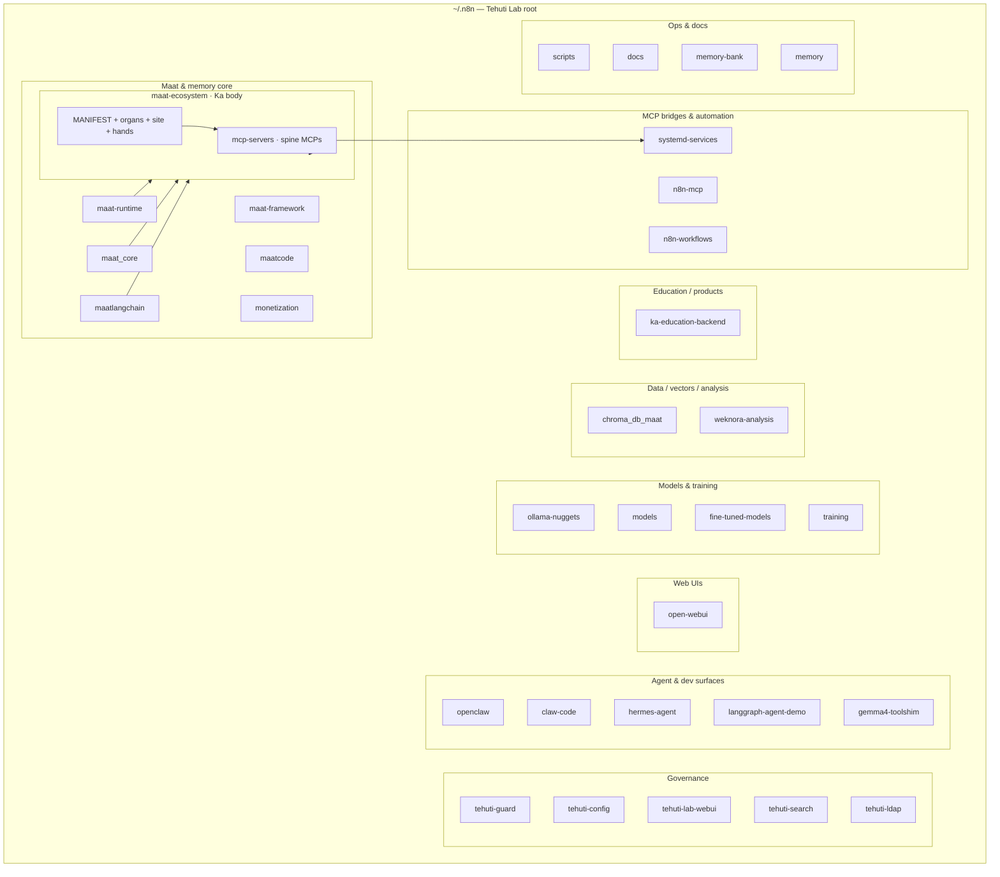
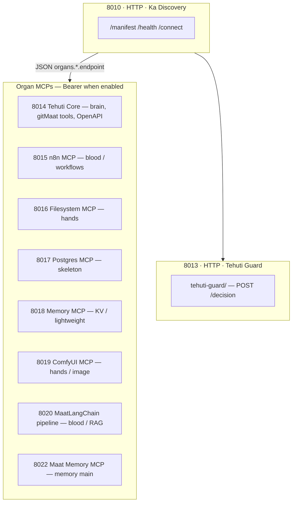

# Tehuti Lab — visual tree (`~/.n8n`)

High-level map of the workspace root. **Folders only** in the trees below; dotfiles and one-off scripts are summarized in a flat list at the end.

---

## 1. Bird’s-eye (Mermaid)



---

## 2. Ka ports & MCP map (reference body)

**Single source of truth on disk:** `maat-ecosystem/MANIFEST.ka` (`network:` block). **Runnable MCP code** lives in **`maat-ecosystem/mcp-servers/`** (lab root **`mcp-servers/`** is a symlink). **Live URLs** for a running host: `GET http://<host>:8010/manifest` (LAN IP appears in JSON). **Human runbook:** `maat-ecosystem/README.md` (Network), `docs/GITMAAT-CONNECT.md`. **Full tree + stack:** [`LAB-CANONICAL-TREE-AND-STACK.md`](LAB-CANONICAL-TREE-AND-STACK.md).

**PostgreSQL note:** gitMaat / Maat Memory persistence uses **`PGVECTOR_DB_URL`** (typically host **:5432**, database `maat_memory`). That is the **database**, not the same thing as the **8017 Postgres MCP** (tooling surface for agents).

### 2.1 Flow — Discovery first



### 2.2 Port table (quick lookup)

| Port | Protocol | Organ (Ka) | Role |
|------|-----------|------------|------|
| **8010** | HTTP | Ka | Discovery — body map & health |
| **8013** | HTTP | Policy / soul | **Tehuti Guard** — `tehuti-guard/` at lab root; `POST /decision` |
| **8014** | MCP | Brain (+ fused hands/memory paths) | Tehuti Core |
| **8015** | MCP | Blood | n8n MCP |
| **8016** | MCP | Hands | Filesystem |
| **8017** | MCP | Skeleton | Postgres MCP (agent tool; not the only DB story) |
| **8018** | MCP | Memory | KV / lightweight memory |
| **8019** | MCP | Hands | ComfyUI |
| **8020** | MCP | Blood | MaatLangChain pipeline / RAG |
| **8022** | MCP | Memory | Maat Memory (main memory organ) |

**LAN / firewall:** see `CLAWD-MCP-ACCESS.md` (expose `8011–8021` / organ range for remote clients). **Auth:** manifest may advertise `Authorization: Bearer <KA_API_KEY>` for organs.

---

## 3. ASCII tree — by role

Use this when you want a **file-system style** picture without every leaf node.

```
~/.n8n/  (Tehuti Lab home)
│
├─── Maat & coordination
│    ├── maat-runtime/            TS agent runtime (Pi fork); GitHub Propershare/Maat-runtime — coding agent CLI, TUI, web-ui (see maat-runtime/README.md)
│    ├── maat_core/               MAAT Core locator (Python): paths to schemas, soul, maatbench/contracts — NOT the same as maat-runtime/ (see docs/MAAT-PRODUCT-MAP.md)
│    ├── maat-ecosystem/          Ka body: MANIFEST.ka, mcp-servers/, soul/, hands/, maatbench/, site/, docs/
│    ├── maat-apps/               Workflow app manifests (duplicate of maat-ecosystem/hands/apps — consolidate over time; see LAB-CANONICAL-TREE-AND-STACK.md)
│    ├── maatlangchain/          RAG, agents, gitMaat (Maat Memory DB)
│    ├── maat-framework/         Shared framework pieces
│    ├── maatcode/               MaatCode / OpenCode-lineage work
│    └── monetization/           Outer-ring / product monetization
│
├─── Governance & Tehuti products
│    ├── tehuti-guard/           Policy / three-ring (TypeScript)
│    ├── tehuti-config/          Lab config helpers
│    ├── tehuti-search/          Search stack
│    ├── tehuti-ldap/            LDAP integration
│    └── tehuti-lab-webui/       Tehuti Lab WebUI (fork lineage)
│         └── tehuti-lab-webui-venv/   (+ backup venv dirs)
│
├─── MCP spine & automation
│    ├── mcp-servers/            Symlink → maat-ecosystem/mcp-servers/ — Ka discovery :8010, Tehuti Core :8014, Maat Memory :8022, …
│    ├── n8n-mcp/              n8n↔MCP bridge
│    ├── n8n-workflows/         Exported / dev workflows
│    ├── systemd-services/      Unit files & drop-ins for organs
│    └── nodes/                   Custom n8n nodes (if present)
│
├─── OpenClaw, coding agents, experiments
│    ├── openclaw/               Upstream OpenClaw clone (apps, dist, skills in-repo)
│    ├── claw-code/              Claw / Codex-related codebase
│    ├── hermes-agent/
│    ├── langgraph-agent-demo/
│    └── gemma4-toolshim/
│
├─── Web UI (broader)
│    └── open-webui/             Open WebUI fork / install tree
│
├─── Models, training, Comfy
│    ├── ollama-nuggets/
│    ├── models/
│    ├── fine-tuned-models/
│    ├── training/
│    ├── comfyui-workflows/
│    └── unsloth_compiled_cache/
│
├─── Data & search backends
│    ├── chroma_db_maat/
│    ├── weknora-analysis/
│    ├── .maat_memory/          Local/cached Maat memory state (dot-dir)
│    ├── binaryData/            n8n/runtime binary payloads
│    ├── cache/, logs/, stats/
│    └── rag-video-workflow.json, social-media-content-generator-ollama.json, …
│
├─── Education & greenfield
│    └── ka-education-backend/   Ka education API (Fastify/Prisma, etc.)
│
├─── Knowledge & runbooks
│    ├── docs/                   GITMAAT-CONNECT, LAB trees, MAAT-FRAMEWORK-REPORT.md, LAB-TRAINING-PIPELINE-AND-GEMMA4.md
│    ├── memory-bank/            System documentation (context, not task DB)
│    └── memory/                 Agent daily notes (e.g. YYYY-MM-DD.md)
│
├─── Shared tooling & specs
│    ├── scripts/
│    ├── hooks/
│    ├── shared/
│    ├── skills/                 Workspace / agent skills
│    ├── tasks/
│    ├── openspec/
│    ├── config/
│    └── reverse-proxy/
│
├─── Starter kits & integrations
│    ├── self-hosted-ai-starter-kit/
│    ├── reports/
│    ├── monitoring/
│    └── ssh/                    SSH helper layout (no secrets in this doc)
│
└─── Archives & quarantine
     ├── staydangerous/           Symlink → `/mnt/ai_backup/staydangerous1` (large backup mount)
     ├── backups/
     ├── _quarantine/
     ├── .reorg-backup-*/
     ├── maatbench.rar
     └── *.md at root (debug, GitMaat, OpenClaw laptop notes, RBG, etc.)
```

---

## 4. Root files that define “who we are”

| Path | Role |
|------|------|
| `AGENTS.md` | Agent session rules for this workspace |
| `SOUL.md` / `IDENTITY.md` / `USER.md` | Identity continuity |
| `MEMORY.md` | Curated long-term notes |
| `HEARTBEAT.md` | Periodic check guidance |
| `.cursorrules` | Maat / workspace conventions for Cursor |
| `opencode.json` | OpenCode MCP / local agent wiring |
| `.env` / `.env.example` | Secrets template (never commit real `.env`) |

---

## 5. Tech stack (summary)

PostgreSQL (gitMaat), Python MCP stack under **`maat-ecosystem/mcp-servers/`**, MaatLangChain, OpenClaw gateway, Ollama, optional n8n — **full table:** [`LAB-CANONICAL-TREE-AND-STACK.md`](LAB-CANONICAL-TREE-AND-STACK.md) §3.

---

## 6. Operator note

- **114** top-level entries under `~/.n8n`; this tree **groups** them so the lab stays legible.
- **Truth on disk** for “what exists”: `ls -1 ~/.n8n | sort`.
- After large moves, refresh this file or add a one-liner in `scripts/` to regenerate a machine listing.
- **Ports / MCP:** keep §2 aligned with `MANIFEST.ka` when the reference body changes.

---

**Last curated:** 2026-04-13 — `mcp-servers` nested under `maat-ecosystem/`; `maat-apps` vs `hands/apps` noted; see `docs/MAAT-PRODUCT-MAP.md`, `docs/LAB-CANONICAL-TREE-AND-STACK.md`.
