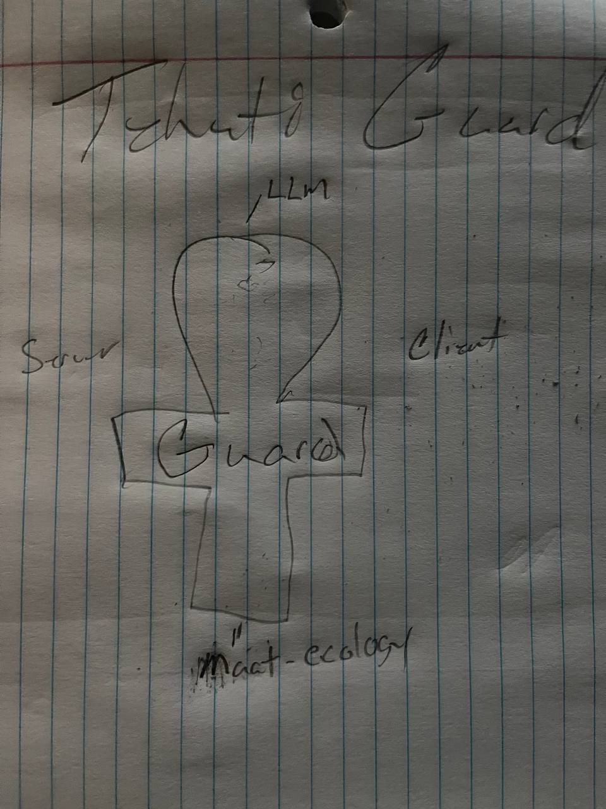

# The Ankh Architecture

> The Ankh is life. Guard is the gatekeeper of that life.

## The Symbol



The Maat Ecosystem follows the **Ankh Architecture** — a framework where every component maps to a part of the ancient Egyptian symbol of life.

```
            ┌─────────┐
           ╱           ╲
          │     LLM     │      ← The Loop (breath / intelligence)
           ╲           ╱
            └─────────┘
                 │
     ┌───────── │ ─────────┐
     │           │           │
 ┌───┴───┐  ┌───┴───┐  ┌───┴───┐
 │Server │  │ GUARD │  │Client │   ← The Crossbar (arms)
 └───────┘  └───┬───┘  └───────┘
                 │
                 │
           ┌─────┴─────┐
           │            │
           │ MAAT-ECO   │         ← The Pillar (foundation)
           │            │
           └────────────┘
```

## Components

### 🔁 The Loop — LLM
The head of the Ankh. The intelligence — reasoning, generation, the breath that animates the system. Any LLM provider (local or remote) sits here.

### ← Server (Left Arm)
The source. MCP servers, APIs, databases, tools — everything the system draws from. Data flows in from the left.

### → Client (Right Arm)
The consumer. Agents, UIs, applications — everything that receives output. Results flow out to the right.

### ✝ The Guard — Tehuti-Guard (The Crux)
The intersection where every arm meets. **Nothing passes without being checked.** Prompt injection detection, path traversal prevention, rate limiting, per-tool policies — all enforced at the crossroads.

The Guard is the crux because security is not a feature — it is the structural requirement that holds everything together.

→ [Tehuti-Guard](https://github.com/Propershare/tehuti-guard)

### 🏛 The Pillar — Maat Ecosystem (Foundation)
The base the entire structure stands on. Shared schemas, identity, governance, memory, and the principles of Maat: **truth, balance, order**. Without the foundation, nothing stands.

→ [Maat Ecosystem](https://github.com/Propershare/maat-ecosystem)

## Why the Ankh?

The Ankh represents life — the union of opposites held together by structure. In this architecture:

- **Server ↔ Client** are balanced arms (input and output)
- **The LLM** is the animating breath
- **The Guard** is the checkpoint at the center — the crux where trust is enforced
- **The Foundation** is Maat — without truth and order, the system collapses

Every request flows through the Ankh. Every response is checked at the cross. The system lives because the structure holds.

---

*Original sketch by Imhotep. Architecture by Tehuti Lab.*
