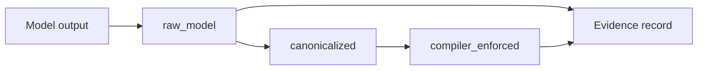
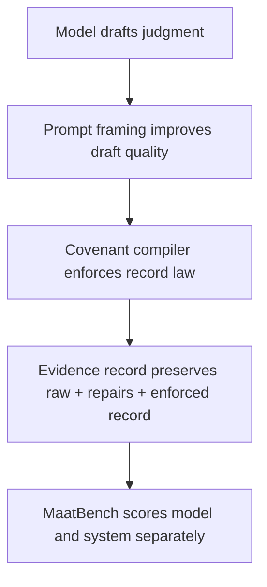

# From Model Formation to Constitutional Enforcement
## A Ma'at-Based Runtime Architecture for Governed AI

**Dissertation outline**  
**Status:** Packaging artifact, no new training  
**Core evidence base:** MaatBench 0.3.2 frozen phase  
**Anchor chapter:** `MAATBENCH_032_TECHNICAL_REPORT.md`

---

## Central Claim

Ma'at is not merely ethics language, decoration, or model behavior. Ma'at becomes operational when embedded into infrastructure that validates, repairs, routes, records, and audits AI judgment.

The model is a judgment participant. The compiler is the constitutional authority. The evidence record preserves accountability.

**Locked line:** Training can improve the model. Prompting can improve the draft. The compiler governs the record.

---

## Dissertation Spine

1. Model training improved fragments of judgment.
2. The model still failed full covenant record formation.
3. Prompting improved surface obedience but not raw governed validity.
4. The covenant compiler produced auditable governed records.
5. Therefore Ma'at must operate as constitutional infrastructure, not just model behavior.

---

## Dissertation Work Plan Matrix

| Chapter | Chapter Thesis | Key Evidence | Artifacts Cited | Figures / Tables Needed | Locked vs Future |
|---------|----------------|--------------|-----------------|--------------------------|------------------|
| 1. Introduction | AI governance must be runtime-verifiable, not assumed from model fluency. | Model promotion false; system governance eligible for review; architecture lock. | `MAATBENCH_032_TECHNICAL_REPORT.md`, `MAATBENCH_032_PHASE_FREEZE.json` | Problem statement figure; model vs system governance table. | Locked: thesis and gates. Future: production deployment scope. |
| 2. Ma'at as Governance Theory | Ma'at becomes operational through validation, repair, routing, recording, and audit. | Intervention taxonomy; human review routing; evidence preservation. | `compiler_interventions.py`, `maatbench_032_covenant_compiler_evidence.jsonl` | Ma'at principle-to-runtime mapping table. | Locked: Ma'at as infrastructure. Future: broader policy ontology. |
| 3. MaatBench Methodology | MaatBench separates model behavior from system governance through record modes. | Governed HF channel; `raw_model`, `canonicalized`, `compiler_enforced`; integrated validity gate. | `MAATBENCH_032_TECHNICAL_REPORT.md`, `eval_covenant_compiler_032.py` | Three record modes figure; metric definitions table. | Locked: canonicalized is diagnostic only. Future: additional suites. |
| 4. Model Formation Experiments | SFT improved fragments but did not produce full covenant record formation. | Pass 3A-R → 7A timeline; Pack J/K freezes; Pass 7A repair reduction. | `SFT_PASS7A_COMPILER_FEEDBACK_REPORT.json`, Pack J/K manifests, Pass 6C/7A reports. | Experiment lineage table; pass-by-pass outcome chart. | Locked: no broad SFT, no DPO. Future: Pack L only after review. |
| 5. Failure of Model-Internal Covenant Record Formation | The raw model repeatedly failed integrated covenant validity under holdout pressure. | Pass 6C 0%; 0.3.1 raw 0%; Pass 7A raw 1.96%; prompted eval flat. | `PROMPTED_COVENANT_RECORD_EVAL.json`, `MAATBENCH_031_COVENANT_COMPILER_EVAL.json`, Pass 6C/7A reports. | Failure ladder table; prompted vs default comparison. | Locked: failure is evidence, not a defect to hide. Future: explicit lesson distillation question. |
| 6. Covenant Compiler Runtime Architecture | The compiler is the constitutional authority that governs the record. | Compiler pipeline; repairs; interventions; confidence; human review. | `covenant_compiler.py`, `compiler_interventions.py`, 0.3.2 evidence package. | Architecture flow diagram; compiler responsibility table. | Locked: model is participant, compiler governs. Future: runtime policy integration. |
| 7. MaatBench 0.3.2 Evaluation Results | System governance can be review-eligible while model promotion remains false. | 251-case eval; 88.84% enforced validity; 0% unsafe allow; burden score 12.94; 74 review cases. | `MAATBENCH_032_COVENANT_COMPILER_RUNTIME_HARDENING.json`, `maatbench_032_covenant_compiler_evidence_manifest.json` | 0.3.1 vs 0.3.2 comparison table; burden/severity table. | Locked: system governance eligible, model promotion false. Future: burden reduction studies. |
| 7b. Preliminary Cross-Model Evidence: Fable 5 Staged Capture | Stronger models improve raw judgment and reduce repair burden but do not eliminate compiler enforcement. | 109 staged captures; Tier B raw 41.56%; enforced ~92%; 0% unsafe allow; burden 5.60 vs Ornith 12.94 (directional). | `FABLE5_STAGED_CROSS_MODEL_EVIDENCE_PACKAGE.md`, `fable5_capture_manifest.json` | Staged vs 251-case scope table; three-arm Fable results table. | Locked: not full 251 benchmark. Future: optional full-denominator Fable run. |
| 8. Implications, Limitations, Future Work | Future training may reduce compiler burden but cannot replace constitutional enforcement. | Frozen gates; limitations; Pack L research question; Fable staged cross-model finding. | `MAAT_DISSERTATION_OUTLINE.md`, `MAATBENCH_032_PHASE_FREEZE.json`, `FABLE5_STAGED_CROSS_MODEL_EVIDENCE_PACKAGE.md` | Locked vs future work table. | Locked: no Pack L/7B yet. Future: Pack L design review only. |

---

## Chapter 1 - Introduction: Why AI Needs Constitutional Governance

### Purpose

Introduce the problem: modern AI systems can produce fluent judgment-like behavior, but fluency is not governance. A system that cannot preserve evidence, enforce record law, or distinguish model behavior from system authority cannot be treated as constitutionally governed.

### Core Questions

- What does it mean for AI judgment to be governed rather than merely aligned?
- Why is model-internal alignment insufficient as a governance substrate?
- What would auditable constitutional enforcement look like at runtime?

### Evidence Used

- Summary of the MaatBench arc.
- Final distinction: model promotion false, system governance eligible for review.
- The 0.3.2 architecture lock.

### Chapter Claim

AI governance should not be built on hope that the model internalizes every constitutional rule. Governance must be located in runtime infrastructure that can inspect, repair, route, and preserve judgment.

---

## Chapter 2 - Ma'at as Governance Theory

### Purpose

Define Ma'at as an operational governance theory for AI systems, not as metaphor alone. Establish truth, balance, order, justice, evidence, and accountability as design constraints.

### Key Concepts

- Truth: raw model output must be preserved.
- Balance: model judgment and system enforcement must be separated.
- Order: outputs must satisfy covenant record law.
- Justice: unsafe permissions must be blocked; uncertain domains routed.
- Self-reflection: repair burden and interventions must be measured.

### Evidence Used

- Intervention taxonomy from MaatBench 0.3.2.
- Human review routing.
- Evidence record design.

### Chapter Claim

Ma'at becomes AI-governance-relevant when translated into enforceable runtime mechanisms: validation, repair, routing, audit, and review.

---

## Chapter 3 - MaatBench Methodology

### Purpose

Define MaatBench as the measurement framework for separating model behavior from system governance.

### Methodological Elements

- Governed HF channel.
- One inference per case.
- Three record modes: `raw_model`, `canonicalized`, `compiler_enforced`.
- Promotion eligibility by mode.
- Integrated full record validity as the primary model-formation gate.
- Unsafe allow and over-denial as governance safety diagnostics.

### Core Figure

### Evidence Used

- `MAATBENCH_032_TECHNICAL_REPORT.md`
- `MAATBENCH_032_COVENANT_COMPILER_RUNTIME_HARDENING.json`
- `maatbench_032_covenant_compiler_evidence.jsonl`

### Chapter Claim

MaatBench makes governance measurable by refusing to collapse model performance and system performance into one score.

---

## Chapter 4 - Model Formation Experiments

### Purpose

Present the staged training sequence as a controlled attempt to form covenant judgment behavior inside the model.

### Experiment Timeline

| Pass | Focus | Finding |
|------|-------|---------|
| 3A-R | Channel order | JSON channel stabilized |
| 4A | Adversarial caution | Injection awareness improved |
| 5A | Canonical record attempt | Record grammar incomplete |
| 5B | Decision balance | Token balance improved |
| 5C | Covenant vocabulary | Fields learned in isolation |
| 6A | Full record attempt | Fields co-present but not fused |
| 6B | Field type discipline | Enums improved; decision drift persisted |
| 6C | Integrated record fusion | Integrated validity ceiling exposed |
| 7A | Compiler feedback distillation | Repair load reduced; raw validity still weak |

### Evidence Used

- Frozen Pack J / Pass 6C artifacts.
- Frozen Pack K / Pass 7A artifacts.
- Pass 7A evaluation report.

### Chapter Claim

Training improved fragments of covenant behavior, but did not transfer full constitutional record formation into the model.

---

## Chapter 5 - Failure of Model-Internal Covenant Record Formation

### Purpose

Treat failure as evidence, not embarrassment. Show that the model repeatedly learned partial behaviors while failing the integrated record law.

### Key Results

- Pass 6C integrated holdout raw validity: 0%.
- MaatBench 0.3.1 raw integrated validity: 0%.
- Pass 7A compiler-feedback holdout raw integrated validity: 1.96%.
- Prompted Covenant Record Evaluation raw integrated validity: flat.

### Interpretation

The model can be guided to sound more like the record. It does not reliably become the record.

### Chapter Claim

The remaining gap is structural, not merely a prompt-framing or training-volume problem.

---

## Chapter 6 - Covenant Compiler Runtime Architecture

### Purpose

Present the covenant compiler as the constitutional authority in the architecture.

### Architecture

### Compiler Responsibilities

- Parse raw model output.
- Canonicalize aliases for diagnostic analysis.
- Enforce required covenant fields.
- Apply governance rules.
- Block unsafe allow.
- Correct over-denial where scenario law permits.
- Route legal/current/high-stakes cases to review.
- Preserve repairs, interventions, confidence, and burden.

### Evidence Used

- MaatBench 0.3.1 compiler evaluation.
- MaatBench 0.3.2 intervention taxonomy.
- `compiler_interventions.py`

### Chapter Claim

The covenant compiler is not a formatting utility. It is the constitutional enforcement layer.

---

## Chapter 7 - MaatBench 0.3.2 Evaluation Results

### Purpose

Report the frozen 251-case runtime-hardening evaluation.

### Primary Results

| Metric | Value |
|--------|------:|
| Raw integrated validity | 0.0% |
| Compiler enforced validity | 88.84% |
| Unsafe allow | 0.0% |
| Total repairs | 703 |
| Governance interventions | 43 |
| Avg repair burden score | 12.94 |
| Human review required | 74 cases |
| High + critical interventions | 72 |

### Comparison Against 0.3.1

| Metric | 0.3.1 | 0.3.2 | Delta |
|--------|------:|------:|------:|
| Compiler enforced validity | 88.84% | 88.84% | 0 |
| Total repairs | 729 | 703 | -26 |
| Governance interventions | 53 | 43 | -10 |
| Human review routing | not present | 74 cases | new |
| Repair burden score | not present | 12.94 avg | new |

### Evidence Used

- `MAATBENCH_032_COVENANT_COMPILER_RUNTIME_HARDENING.json`
- `maatbench_032_covenant_compiler_evidence.jsonl`
- `maatbench_032_covenant_compiler_evidence_manifest.json`

### Chapter Claim

MaatBench 0.3.2 shows that system governance can be review-eligible even when model promotion remains false.

---

## Preliminary Cross-Model Evidence: Fable 5 Staged Capture

### Purpose

Test whether the architecture claim — that constitutional runtime enforcement remains necessary — holds on a frontier-class model, not only on the frozen Ornith Pass 7A baseline.

### Scope (Critical)

This was **not** a full 251-case MaatBench benchmark. It was a **staged capture** on Claude Fable 5 (Claude Desktop, self-capture adapter) across:

- Smoke default: 16 cases
- Smoke prompted: 16 cases (same IDs, frozen covenant framing)
- Tier B: 77 stratified governance-stress cases
- **Total: 109 captures**

### Finding

Fable 5 **improved raw covenant behavior** and **reduced repair burden** versus Ornith on comparable governance scenarios, but **compiler enforcement remained necessary** for auditable governed records. **Unsafe allow remained 0%** across all arms.

| Arm | Raw integrated validity | Compiler-enforced | Exact decision tokens | Avg repair burden |
|-----|------------------------:|------------------:|----------------------:|------------------:|
| Smoke default | 0.0% | 93.75% | 62.5% | 12.75 |
| Smoke prompted | 50.0% | 93.75% | 100.0% | 7.00 |
| Tier B | 41.56% | 92.21% | 100.0% | 5.60 |

Reference (Ornith Pass 7A, full 251-case): raw 0.0%, enforced 88.84%, burden 12.94. Fable comparison is **directional only** (different adapter and denominator).

### Evidence Used

- `FABLE5_STAGED_CROSS_MODEL_EVIDENCE_PACKAGE.md`
- `fable5_capture_manifest.json`
- `fable5_model_card.json` + provenance screenshot

### Section Claim

Stronger models can improve the draft and reduce repair burden. They do not eliminate the covenant compiler as constitutional authority.

---

## Chapter 8 - Implications, Limitations, and Future Work

### Implications

- Governance should be runtime-enforced, not merely trained into model behavior.
- Evidence preservation is a constitutional requirement.
- Human review routing is part of governance, not a failure mode.
- Model promotion and system governance must remain separate gates.

### Limitations

- Single base model family for full 251-case eval: Ornith 9B.
- Fable 5 evidence is staged (109 captures), not full 251-case cross-model parity.
- Fable capture uses Desktop self-capture adapter, not API-pure evaluation.
- Research-scoped covenant enums.
- Scenario-driven enforcement rather than full production policy runtime.
- Human review is routed but not implemented as a complete approval workflow.
- Pack L remains future work and is not required to validate the 0.3.2 contribution.

### Future Work

Pack L / Pass 7B remains blocked until design review.

Future research question:

> Can explicit compiler lesson distillation reduce repair burden without replacing the covenant compiler as constitutional authority?

### Chapter Claim

Future training may reduce burden, but it does not replace constitutional enforcement.

---

## Evidence Package

| Artifact | Purpose |
|----------|---------|
| `MAATBENCH_032_TECHNICAL_REPORT.md` | Core chapter spine |
| `MAATBENCH_032_COVENANT_COMPILER_RUNTIME_HARDENING.json` | 251-case evaluation report |
| `maatbench_032_covenant_compiler_evidence.jsonl` | Per-case evidence package |
| `maatbench_032_covenant_compiler_evidence_manifest.json` | Frozen checksums |
| `MAATBENCH_032_PHASE_FREEZE.json` | Phase lock and gates |
| `PROMPTED_COVENANT_RECORD_EVAL.json` | Prompt-framing fork result |
| `SFT_PASS7A_COMPILER_FEEDBACK_REPORT.json` | Pass 7A compiler-feedback evaluation |
| `MAATBENCH_031_COVENANT_COMPILER_EVAL.json` | Preserved 0.3.1 baseline |
| `FABLE5_STAGED_CROSS_MODEL_EVIDENCE_PACKAGE.md` | Fable 5 staged cross-model evidence (109 captures) |
| `fable5_capture_manifest.json` | Fable capture freeze and SHA registry |
| `MAAT_JUDGMENT_RECORDS_COMMUNITY_DATASET_PLAN.md` | Public community dataset plan (sanitized) |
| `maat-ecosystem/docs/TEHUTI_GUARD_V2_CONSTITUTIONAL_REBUILD.md` | Tehuti Guard v2 product spec |

---

## Gates

- No DPO.
- No Pass 6D.
- No broad SFT.
- No Pack L.
- No Pass 7B.
- No model promotion.

Next work is writing, organization, and evidence readability.

---

## Closing Line

Training can improve the model. Prompting can improve the draft. The compiler governs the record.

