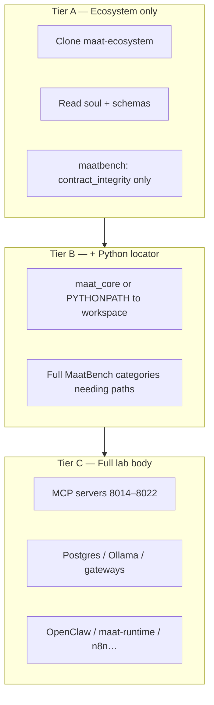
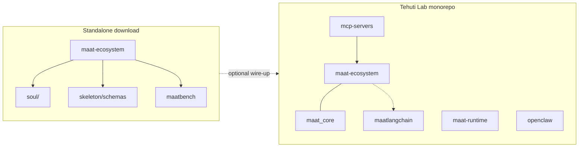

# Distributing and running `maat-ecosystem` elsewhere

**Question:** Can someone download **only** `maat-ecosystem`, run it on their machine, and get the “full body”?

**Short answer:** They can always run the **constitutional layer** (soul, skeleton schemas, contracts, docs, MaatBench contract tier). The **living organs** (MCP servers, databases, gateways, models) live **outside** this folder in a typical Tehuti Lab checkout — see **tiers** below.

---

## What this folder is vs is not

| In the box (`maat-ecosystem/`) | Outside the box (rest of lab / ops) |
|--------------------------------|-------------------------------------|
| `MANIFEST.ka`, organ layout, `soul/` | Ka Discovery **8010**, organ MCP processes |
| `skeleton/schemas/`, bench contracts | PostgreSQL, Ollama, n8n, OpenClaw, etc. |
| `maatbench/` (verification runner) | `maatlangchain/`, `mcp-servers/`, `maat-runtime/` |
| Docs, `site/` | Network URLs, API keys, systemd units |

So: **package = portable doctrine + contracts + tests.**  
**Deploy “full Maat” = ecosystem + sibling repos + configured services** (see [`docs/MAAT-PRODUCT-MAP.md`](../docs/MAAT-PRODUCT-MAP.md)).

---

## Three tiers (what “runs” means)

| Tier | You need | Typical result |
|------|----------|----------------|
| **A** | Git, Python 3 for MaatBench | Schema/contract checks pass; **no** network organs |
| **B** | `maat_core` resolving `maat-ecosystem/` (see below) | Broader MaatBench categories that load schemas via `maat_core` |
| **C** | Full monorepo + env per [`docs/SYSTEM-CONNECTIONS.md`](../docs/SYSTEM-CONNECTIONS.md) | End-to-end tools, RAG, memory MCP — **audit reality** in [`docs/ka-audit-2026-04-06.md`](docs/ka-audit-2026-04-06.md) |

---

## Detach / separate: own Git repo

`maat-ecosystem` can be its **own repository** (subtree split, or copy + fresh `git init`). After detach:

1. **Keep** `LICENSE`, `README.md`, `MANIFEST.ka`, organs as-is.  
2. **Document** that [`maat_core`](../maat_core/) (sibling in monorepo) is optional: path resolution walks up to find `maat-ecosystem/skeleton/schemas` **or** set `PYTHONPATH` to a parent that contains both.  
3. **Publish** `maat_core` to PyPI later if you want `pip install maat-core` without monorepo — today it is **monorepo-local** ([`maat_core/README.md`](../maat_core/README.md)).

**LAB-WORKSPACE** note: [`LAB-WORKSPACE.md`](LAB-WORKSPACE.md) describes living inside a bigger tree; this file describes **leaving** that tree cleanly.

---

## Package (practical options today)

| Approach | Good for |
|----------|----------|
| **Git repo = `maat-ecosystem` only** | Doctrine + schemas + bench + site; smallest “product” |
| **Monorepo with path** | Current Tehuti Lab — one clone, everything wired |
| **Git submodule** | App repo embeds `maat-ecosystem` at a fixed commit |
| **Tarball / release asset** | Frozen snapshot for papers or audits |

There is **no** single Docker image in `maat-ecosystem/` that replaces the whole lab; adding Compose for *optional* Postgres + Ollama is a **separate** packaging effort.

---

## Can it run on their computer?

**Yes**, with honest limits:

- **Any OS** that runs Python 3: Tier A MaatBench (`contract_integrity`) from `maat-ecosystem/` per [`maatbench/README.md`](maatbench/README.md).  
- **Linux/macOS** are what the lab scripts assume; Windows may need path tweaks for `maat_core`.  
- **Tier C** needs RAM/GPU per your models, open ports, and same constraints as any self-hosted AI stack.

---

## Deploy (recommended story for testers)

1. **Minimal:** `git clone` → `cd maat-ecosystem` → `python3 -m maatbench.run --category contract_integrity --verbose` (from parent `maat-ecosystem` per README — see maatbench README for exact `cd`).  
2. **With organs:** Clone **full workspace** (or documented subset), configure `.env`, start services per [`docs/FIRST-RUN.md`](../docs/FIRST-RUN.md) and [`docs/SYSTEM-CONNECTIONS.md`](../docs/SYSTEM-CONNECTIONS.md).  
3. **Production:** Same as (2) plus secrets management, TLS, non-default hosts — not automated in this repo alone.

---

## Visual — monorepo vs standalone ecosystem

---

## Related

- [`README.md`](README.md) — Ka body overview, ports table  
- [`MANIFEST.ka`](MANIFEST.ka) — DNA  
- [`docs/WORKSPACE-KA-MAP.md`](../docs/WORKSPACE-KA-MAP.md) — how the rest of the workspace maps to organs  
- [`docs/GITHUB-REPO-MAP.md`](../docs/GITHUB-REPO-MAP.md) — federation / publish guidance  
