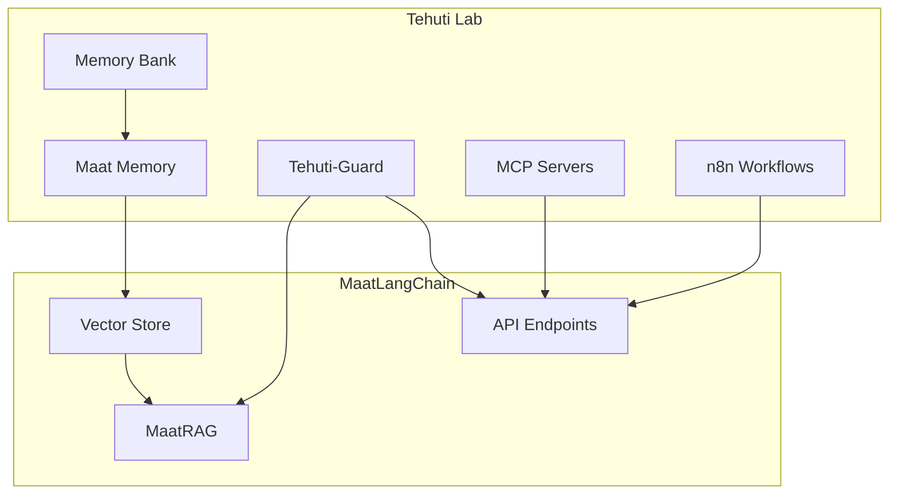

# Tehuti Lab Integration with MaatLangChain

## Overview

MaatLangChain integrates with the broader Tehuti Lab ecosystem through shared infrastructure, governance, and knowledge architecture.

## Maat Knowledge Architecture

The **Maat Knowledge Architecture** provides the foundation for all Tehuti Lab knowledge:

### Core Components

1. **Memory Bank** (`memory-bank/`)
   - Architecture documentation
   - Workflow knowledge
   - Learnings and pivots
   - Cross-machine coordination

2. **Maat Memory System** (PostgreSQL)
   - Agent decisions and learnings
   - Cross-session memory
   - Audit trail
   - Vector search

3. **Tehuti-Guard**
   - Validation layer
   - Maat compliance checking
   - Security enforcement

## Integration Points

### 1. Shared PostgreSQL/pgvector

**MaatLangChain uses:**
- Document vectors for RAG
- Knowledge base storage
- Semantic search

**Tehuti Lab uses:**
- Agent memory storage
- Workflow state
- Cross-machine coordination

**Shared:**
- Same database instance
- Same connection pool
- Same vector store infrastructure

### 2. Maat Memory System

**Location:** `maatlangchain/maat_memory/`

**Features:**
- Cross-session memory
- Machine/terminal tracking
- Conversation logging
- Audit trail
- Vector search

**Integration:**
- Used by MaatLangChain API
- Used by Tehuti Lab agents
- Shared across all projects

### 3. Tehuti-Guard

**Purpose:** Policy enforcement and Maat compliance

**Functions:**
- Validate knowledge updates
- Check Maat compliance
- Enforce security policies
- Audit agent actions

**Integration:**
- Validates MaatLangChain responses
- Enforces three-ring classification
- Monitors agent behavior

## Workflow Integration

### MCP Servers

**Port Assignments (8011-8024):**
- 8011: Tehuti-Methodology-MCP
- 8012: Tehuti-Research-MCP
- 8013: Tehuti-Integration-MCP
- 8019: ComfyUI Intelligent MCP
- 8022: Tehuti-Memory-Bank MCP (planned)

**MaatLangChain Integration:**
- Can call MCP tools via OpenWebUI
- Shares governance framework
- Uses same authentication

### n8n Workflows

**Patterns:**
- Document processing workflows
- RAG query workflows
- Knowledge base updates
- Agent coordination

**Integration:**
- MaatLangChain API endpoints
- Webhook triggers
- Shared PostgreSQL state

## Knowledge Flow

## Principles

### Maat Principles in Integration

1. **Truth**
   - Verified knowledge only
   - Evidence-based decisions
   - Honest assessment

2. **Balance**
   - Essential knowledge only
   - Efficient resource usage
   - No redundancy

3. **Order**
   - Clear structure
   - Consistent patterns
   - Maintain organization

4. **Reciprocity**
   - Share knowledge
   - Credit sources
   - Community-built

## Next Steps

1. **Implement MCP Server** (Port 8022)
   - Tehuti-Memory-Bank MCP
   - Knowledge base access
   - Workflow coordination

2. **Populate Examples**
   - n8n workflow templates
   - OpenWebUI patterns
   - MCP server examples

3. **Enhance Tehuti-Guard**
   - Maat compliance checking
   - Security enforcement
   - Audit trail

4. **Cross-Machine Coordination**
   - Webmin integration
   - Machine-specific knowledge
   - Shared resources

## Documentation

- **Maat Knowledge Architecture:** `docs/MAAT-KNOWLEDGE-ARCHITECTURE.md`
- **Tehuti Lab Integration:** `docs/TEHUTI-LAB-INTEGRATION.md` (this file)
- **MaatLangChain Value Proposition:** `MAATLANGCHAIN-VALUE-PROPOSITION.md`

## Foundation Complete

The integration foundation is complete. MaatLangChain and Tehuti Lab now share:
- Infrastructure (PostgreSQL, Redis, Ollama)
- Governance (Tehuti-Guard, Maat principles)
- Knowledge (Memory Bank, Maat Memory)
- Tools (MCP servers, n8n workflows)

**Built to last. Built with Maat.**

